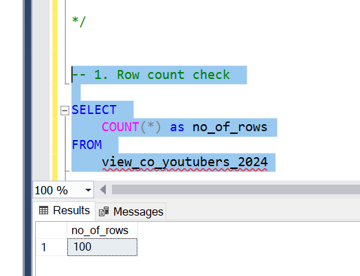
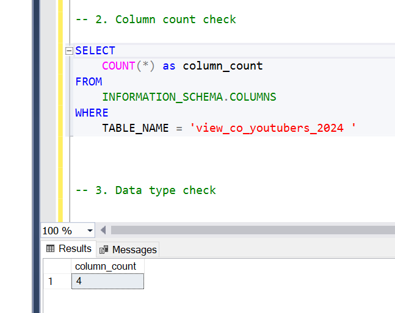
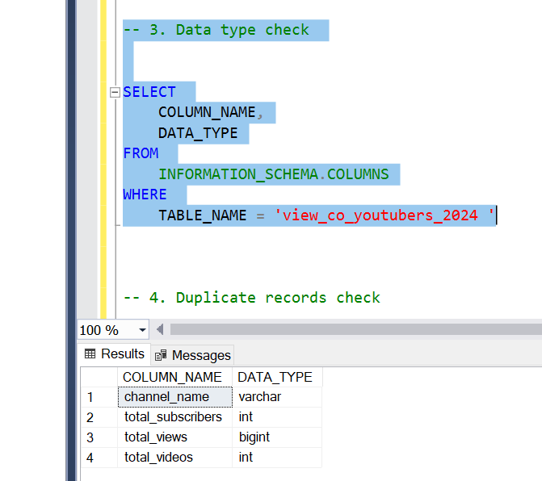
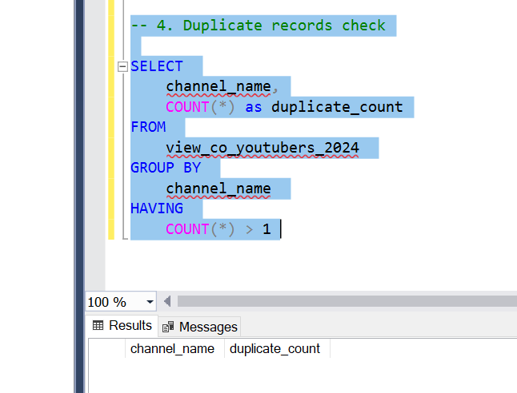
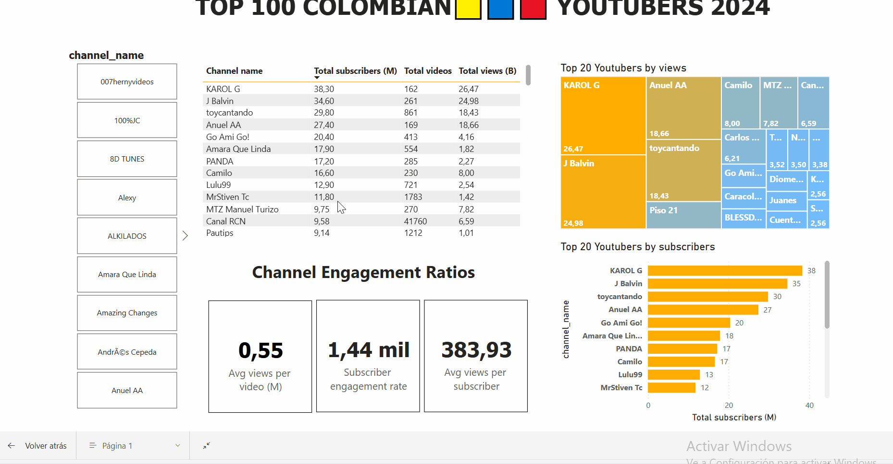
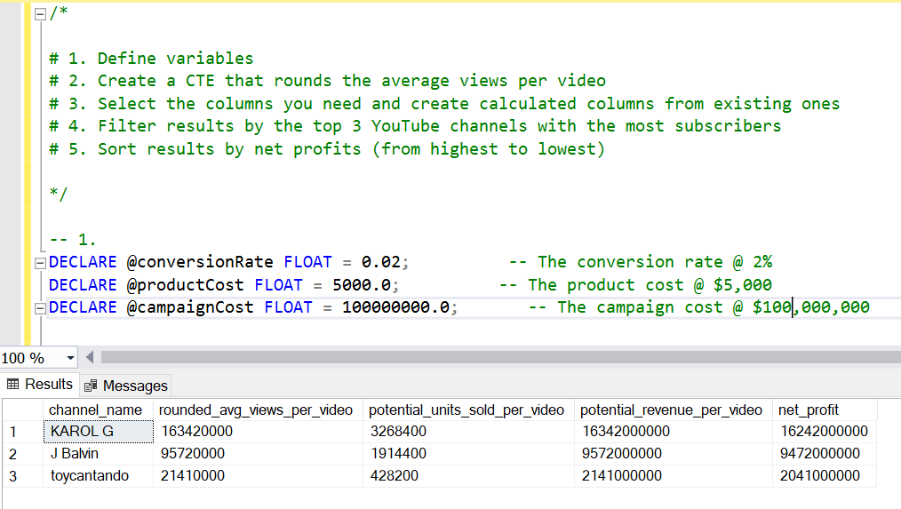
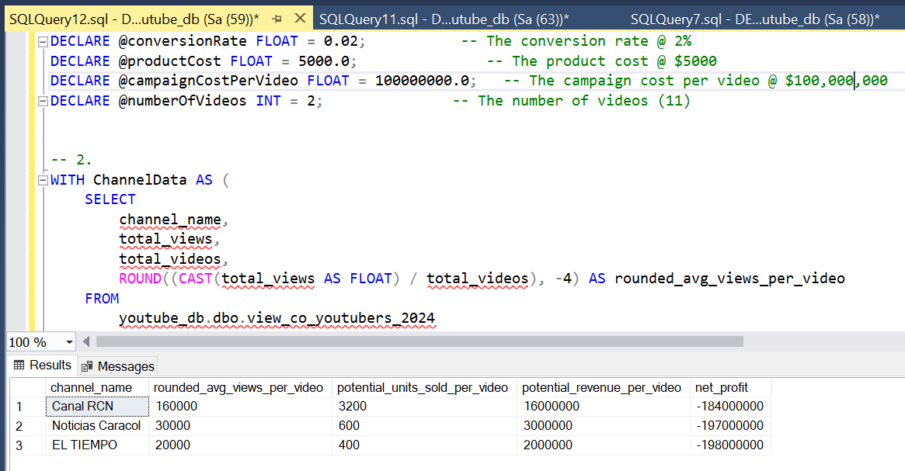
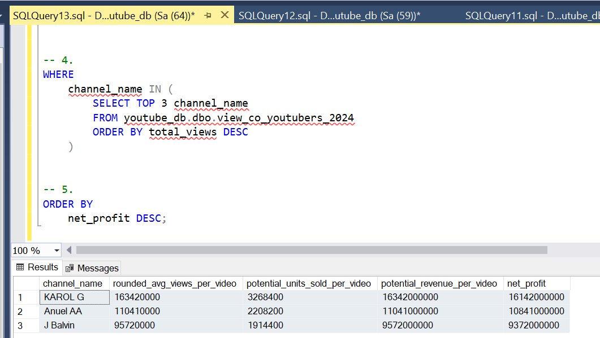

# Data Analyst Portfolio: YouTube Channel Data Analysis Insights for Strategic Marketing


# Table of contents 

- [Objective](#objective)
- [Data Source](#data-source)
- [Stages](#stages)
- [Design](#design)
  - [Mockup](#mockup)
  - [Tools](#tools)
- [Development](#development)
  - [Pseudocode](#pseudocode)
  - [Data Exploration](#data-exploration)
  - [Data Cleaning](#data-cleaning)
  - [Transform the Data](#transform-the-data)
  - [Create the SQL View](#create-the-sql-view)
- [Testing](#testing)
  - [Data Quality Tests](#data-quality-tests)
- [Visualization](#visualization)
  - [Results](#results)
  - [DAX Measures](#dax-measures)
- [Analysis](#analysis)
  - [Findings](#findings)
  - [Validation](#validation)
  - [Discovery](#discovery)
- [Recommendations](#recommendations)
  - [Potential ROI](#potential-roi)
  - [Potential Courses of Actions](#potential-courses-of-actions)
- [Conclusion](#conclusion)


# Objective 

- What is the key pain point? 

The Head of Marketing wants to find out who the top YouTubers are in 2024 to decide on which YouTubers would be best to run marketing campaigns throughout the rest of the year.


- What is the ideal solution? 

To create a dashboard that provides insights into the top COLOMBIAN YouTubers in 2024 that includes their 
- subscriber count
- total views
- total videos, and
- engagement metrics

This will help the marketing team make informed decisions about which YouTubers to collaborate with for their marketing campaigns.

## User story 

As the Head of Marketing, I want to use a dashboard that analyses YouTube channel data in Colombia💛💙💝 . 

This dashboard should allow me to identify the top performing channels based on metrics like subscriber base and average views. 

With this information, I can make more informed decisions about which Youtubers are right to collaborate with, and therefore maximize how effective each marketing campaign is.


# Data source 

- What data is needed to achieve our objective?

We need data on the top COLOMBIAN YouTubers in 2024 that includes their 
- channel names
- total subscribers
- total views
- total videos uploaded


- Where is the data coming from? 
The data is sourced from Kaggle (an CSV extract), [see here to find it.](https://www.kaggle.com/datasets/bhavyadhingra00020/top-100-social-media-influencers-2024-countrywise?resource=download)


# Stages

- Design
- Developement
- Testing
- Analysis 
 


# Design 

## Dashboard components required 
- What should the dashboard contain based on the requirements provided?

To understand what it should contain, we need to figure out what questions we need the dashboard to answer:

1. Who are the top 10 YouTubers with the most subscribers?
2. Which 3 channels have uploaded the most videos?
3. Which 3 channels have the most views?
4. Which 3 channels have the highest average views per video?
5. Which 3 channels have the highest views per subscriber ratio?
6. Which 3 channels have the highest subscriber engagement rate per video uploaded?

For now, these are some of the questions we need to answer, this may change as we progress down our analysis. 


## Dashboard mockup

- What should it look like? 

Some of the data visuals that may be appropriate in answering our questions include:

1. Table
2. Treemap
3. Scorecards
4. Horizontal bar chart 


## Tools 


| Tool | Purpose |
| --- | --- |
| Excel | Exploring the data |
| Python | Use the youtube Api for extract recent data from youtube channels |
| SQL Server | Cleaning, testing, and analyzing the data |
| Power BI | Visualizing the data via interactive dashboards |
| GitHub | Hosting the project documentation and version control |
| Mokkup AI | Designing the wireframe/mockup of the dashboard | 


# Development

## Pseudocode

- What's the general approach in creating this solution from start to finish?

1. Get the data
2. Explore the data in Excel
3. Make a webscrapping with python for obtain a recent data from youtube channels (yOUTUBE API)
4. Load the data into SQL Server
5. Clean the data with SQL
6. Test the data with SQL
7. Visualize the data in Power BI
8. Generate the findings based on the insights
9. Write the documentation + commentary
10. Publish the data to GitHub Pages

## Data exploration notes

This is the stage where you have a scan of what's in the data, errors, inconcsistencies, bugs, weird and corrupted characters etc  


- What are your initial observations with this dataset? What's caught your attention so far? 

1. There are at least 4 columns that contain the data we need for this analysis, which signals we have everything we need from the file without needing to contact the client for any more data. 
2. The first column contains the channel ID with what appears to be channel IDS, which are separated by a @ symbol - we need to extract the channel names from this.
3. Some of the cells and header names are in a different language - we need to confirm if these columns are needed, and if so, we need to address them.
4. We have more data than we need, so some of these columns would need to be removed


---
# Extraction and Update of YouTube Channel Data with Python

## Description
In this step, we use the YouTube API to retrieve updated statistics for a list of channels sourced from a Kaggle dataset. The extracted data includes the channel name, total number of subscribers, views, and videos. Afterward, the updated information is merged with the original dataset and exported to a new CSV file.

---

## Implemented Steps

### 1. **Initial Configuration**
Load the necessary libraries and set up the YouTube API with the provided key.

```python
import os
import pandas as pd
from googleapiclient.discovery import build

API_KEY = "YOUR_API_KEY" #USE A .env file for security of your Api
API_VERSION = 'v3'

# Initialize the YouTube API client
youtube = build('youtube', API_VERSION, developerKey=API_KEY)
```

---

### 2. **Function to Get Channel Statistics**
Define a function that uses the API to retrieve statistics for a given channel ID.

```python
def get_channel_stats(youtube, channel_id):
    request = youtube.channels().list(
        part='snippet, statistics',
        id=channel_id
    )
    response = request.execute()

    if response['items']:
        data = dict(
            channel_name=response['items'][0]['snippet']['title'],
            total_subscribers=response['items'][0]['statistics']['subscriberCount'],
            total_views=response['items'][0]['statistics']['viewCount'],
            total_videos=response['items'][0]['statistics']['videoCount'],
        )
        return data
    else:
        return None
```

---

### 3. **Load Base File and Prepare IDs**
Load the base file and extract unique channel IDs.

```python
# Read base file
df = pd.read_excel("youtube_data_colombia.xlsx")
df.head()

# Extract unique channel IDs
channel_ids = df['NAME'].str.split('@').str[-1].unique()
```

---

### 4. **Extract Statistics for Each Channel**
Iterate over the IDs and retrieve statistics for each channel, handling possible errors.

```python
channel_stats = []

for channel_id in channel_ids:
    try:
        stats = get_channel_stats(youtube, channel_id)
        if stats is not None:
            channel_stats.append(stats)
        else:
            channel_stats.append({
                'channel_name': 'Unknown',
                'total_subscribers': 0,
                'total_views': 0,
                'total_videos': 0
            })
    except KeyError as e:
        print(f"Error with ID {channel_id}: Key 'items' not found. {e}")
        channel_stats.append({
            'channel_name': 'Unknown',
            'total_subscribers': 0,
            'total_views': 0,
            'total_videos': 0
        })
    except Exception as e:
        print(f"Error with ID {channel_id}: {e}")
        channel_stats.append({
            'channel_name': 'Unknown',
            'total_subscribers': 0,
            'total_views': 0,
            'total_videos': 0
        })
```

---

### 5. **Combine Data**
Convert the list of statistics into a DataFrame and combine it with the original file.

```python
# Convert statistics to DataFrame
stats_df = pd.DataFrame(channel_stats)

# Reset indexes
df.reset_index(drop=True, inplace=True)
stats_df.reset_index(drop=True, inplace=True)

# Combine original data with updated statistics
combined_df = pd.concat([df, stats_df], axis=1)
```

---

### 6. **Export Results**
Save the combined DataFrame into a new CSV file.

```python
# Save to a CSV file
combined_df.to_csv('updated_youtube_data_co.csv', index=False)

# View first rows
combined_df.head(10)
```

---

## Output
The file **`updated_youtube_data_co.csv`** contains:
- Original data from the base file.
- Updated information on:
  - Channel name.
  - Total subscribers.
  - Total views.
  - Total videos.

---


## Data cleaning 
- What do we expect the clean data to look like? (What should it contain? What contraints should we apply to it?)

The aim is to refine our dataset to ensure it is structured and ready for analysis. 

The cleaned data should meet the following criteria and constraints:

- Only relevant columns should be retained.
- All data types should be appropriate for the contents of each column.
- No column should contain null values, indicating complete data for all records.

Below is a table outlining the constraints on our cleaned dataset:

| Property | Description |
| --- | --- |
| Number of Rows | 100 |
| Number of Columns | 4 |

And here is a tabular representation of the expected schema for the clean data:

| Column Name | Data Type | Nullable |
| --- | --- | --- |
| channel_name | VARCHAR | NO |
| total_subscribers | INTEGER | NO |
| total_views | INTEGER | NO |
| total_videos | INTEGER | NO |


- What steps are needed to clean and shape the data into the desired format?

1. Remove unnecessary columns by only selecting the ones you need
2. Extract Youtube channel names from the first column
3. Rename columns using aliases


### Transform the data 


```sql
/* 
Step 1: Data Cleaning and Transformation
1. Select only the necessary columns.
2. Extract YouTube channel names from the first column using text functions.
3. Rename columns for better clarity and consistency.
*/

/* Select the relevant columns from the table */
SELECT
    NAME,                -- Column containing the channel names in the format '@name'
    total_subscribers,   -- Total number of channel subscribers
    total_views,         -- Total number of channel views
    total_videos         -- Total number of channel videos
FROM
    updated_youtube_data_co; -- Original table containing unprocessed data

/* 
Step 2: Identify the position of the '@' character in the NAME column
This is necessary to extract the channel name before the '@'.
*/

SELECT 
    CHARINDEX('@', NAME) AS at_position, -- Position of the '@' character within the NAME text
    NAME                                  -- Original channel name
FROM 
    updated_youtube_data_co;              -- Original data table
```


### Create the SQL view 

```sql
/* 
Step 3: Create a view to store the processed data
1. Extract the channel name before the '@' character using SUBSTRING.
2. Convert the extracted text to a format of up to 100 characters using CAST.
3. Include the main metrics for each channel (subscribers, views, videos).
*/

CREATE VIEW view_co_youtubers_2024 AS
SELECT
    CAST(SUBSTRING(NAME, 1, CHARINDEX('@', NAME) - 1) AS VARCHAR(100)) AS channel_name, -- Channel name (text before the '@')
    total_subscribers,                                                                  -- Total number of subscribers
    total_views,                                                                        -- Total number of views
    total_videos                                                                        -- Total number of videos
FROM 
    updated_youtube_data_co; -- Original table containing unprocessed data


```


# Testing 

- What data quality and validation checks are you going to create?

Here are the data quality tests conducted:

## Row count check
```sql
/*
# Count the total number of records (or rows) are in the SQL view
*/

SELECT
    COUNT(*) AS no_of_rows
FROM
    view_co_youtubers_2024;

```




## Column count check
### SQL query 
```sql
/*
# Count the total number of columns (or fields) are in the SQL view
*/


SELECT
    COUNT(*) AS column_count
FROM
    INFORMATION_SCHEMA.COLUMNS
WHERE
    TABLE_NAME = 'view_co_youtubers_2024'
```
### Output 



## Data type check
### SQL query 
```sql
/*
# Check the data types of each column from the view by checking the INFORMATION SCHEMA view
*/

-- 1.
SELECT
    COLUMN_NAME,
    DATA_TYPE
FROM
    INFORMATION_SCHEMA.COLUMNS
WHERE
    TABLE_NAME = 'view_co_youtubers_2024';
```
### Output



## Duplicate count check
### SQL query 
```sql
/*
# 1. Check for duplicate rows in the view
# 2. Group by the channel name
# 3. Filter for groups with more than one row
*/

-- 1.
SELECT
    channel_name,
    COUNT(*) AS duplicate_count
FROM
    view_co_youtubers_2024

-- 2.
GROUP BY
    channel_name

-- 3.
HAVING
    COUNT(*) > 1;
```
### Output


# Visualization 


## Results

- What does the dashboard look like?



This shows the Top COLOMBIAN Youtubers in 2024 so far. 
[Show the dashboard here👇👇](assets/docs/dashboard.html)

## DAX Measures

### 1. Total Subscribers (M)
```sql
Total Subscribers (M) = 
VAR million = 1000000
VAR sumOfSubscribers = SUM(view_co_youtubers_2024[total_subscribers])
VAR totalSubscribers = DIVIDE(sumOfSubscribers,million)

RETURN totalSubscribers

```

### 2. Total Views (B)
```sql
Total Views (B) = 
VAR billion = 1000000000
VAR sumOfTotalViews = SUM(view_co_youtubers_2024[total_views])
VAR totalViews = ROUND(sumOfTotalViews / billion, 2)

RETURN totalViews

```

### 3. Total Videos
```sql
Total Videos = 
VAR totalVideos = SUM(view_co_youtubers_2024[total_videos])

RETURN totalVideos

```

### 4. Average Views Per Video (M)
```sql
Average Views per Video (M) = 
VAR sumOfTotalViews = SUM(view_co_youtubers_2024[total_views])
VAR sumOfTotalVideos = SUM(view_co_youtubers_2024[total_videos])
VAR  avgViewsPerVideo = DIVIDE(sumOfTotalViews,sumOfTotalVideos, BLANK())
VAR finalAvgViewsPerVideo = DIVIDE(avgViewsPerVideo, 1000000, BLANK())

RETURN finalAvgViewsPerVideo 

```


### 5. Subscriber Engagement Rate
```sql
Subscriber Engagement Rate = 
VAR sumOfTotalSubscribers = SUM(view_co_youtubers_2024[total_subscribers])
VAR sumOfTotalVideos = SUM(view_co_youtubers_2024[total_videos])
VAR subscriberEngRate = DIVIDE(sumOfTotalSubscribers, sumOfTotalVideos, BLANK())

RETURN subscriberEngRate 

```


### 6. Views per subscriber
```sql
Views Per Subscriber = 
VAR sumOfTotalViews = SUM(view_co_youtubers_2024[total_views])
VAR sumOfTotalSubscribers = SUM(view_co_youtubers_2024[total_subscribers])
VAR viewsPerSubscriber = DIVIDE(sumOfTotalViews, sumOfTotalSubscribers, BLANK())

RETURN viewsPerSubscriber 

```


# Analysis 

## Findings

- What did we find?

For this analysis, we're going to focus on the questions below to get the information we need for our marketing client - 

Here are the key questions we need to answer for our marketing client: 
1. Who are the top 10 YouTubers with the most subscribers?
2. Which 3 channels have uploaded the most videos?
3. Which 3 channels have the most views?
4. Which 3 channels have the highest average views per video?
5. Which 3 channels have the highest views per subscriber ratio?
6. Which 3 channels have the highest subscriber engagement rate per video uploaded?


### 1. Who are the top 10 YouTubers with the most subscribers?

| Rank | Channel Name         | Subscribers (M) |
|------|----------------------|-----------------|
| 1    | KAROL G              | 38.30           |
| 2    | J Balvin             | 38.60           |
| 3    | toycantando          | 29.80           |
| 4    | Anuel AA             | 27.40           |
| 5    | Go Ami Go!           | 20.40           |
| 6    | Amara Que Linda      | 17.90           |
| 7    | PANDA                | 17.20           |
| 8    | Camilo               | 16.60           |
| 9    | Lulu99               | 12.90           |
| 10   | MrStiven Tc          | 11.80           |


### 2. Which 3 channels have uploaded the most videos?

| Rank | Channel Name    | Videos Uploaded |
|------|-----------------|-----------------|
| 1    | Noticias Caracol| 103,525          |
| 2    | EL TIEMPO       | 59,870           |
| 3    | CANAL RCN       | 41,760           |


### 3. Which 3 channels have the most views?


| Rank | Channel Name | Total Views (B) |
|------|--------------|-----------------|
| 1    | KAROL G      | 26.47           |
| 2    | J Balvin     | 24.98           |
| 3    | Anuel AA     | 18.66           |


### 4. Which 3 channels have the highest average views per video?

| Channel Name | Averge Views per Video (M) |
|--------------|-----------------|
| KAROL G      | 163.42          |
| Anuel AA     | 110.41          |
| J Balvin     | 95.72           |


### 5. Which 3 channels have the highest views per subscriber ratio?

| Rank | Channel Name       | Views per Subscriber        |
|------|-----------------   |---------------------------- |
| 1    | BLESSD EL BENDITO  | 1046.02                     |
| 2    | Piso 21            | 1041.43                     |
| 3    | Juanes             | 1031.31                     |


### 6. Which 3 channels have the highest subscriber engagement rate per video uploaded?

| Rank | Channel Name    | Subscriber Engagement Rate  |
|------|-----------------|---------------------------- |
| 1    | KAROL G         | 236,419.75                  |
| 2    | Anuel AA        | 162,130.18                  |
| 3    | J Balvin        | 132,567.05                  |


### Notes

For this analysis, we'll prioritize analysing the metrics that are important in generating the expected ROI for our marketing client, which are the YouTube channels wuth the most 

- subscribers
- total views
- videos uploaded


## Validation 

### 1. Scenario: Youtubers with the Most Subscribers
 

#### Top 3 Channels and Key Metrics:

***KAROL G:**
- Average views per video: 163,420,000
- Potential units sold per video: 3,268,400
- Potential revenue per video: 16,342,000,000
- Net profit: 16,242,000,000
  
**J Balvin:**
- Average views per video: 95,720,000
- Potential units sold per video: 1,914,400
- Potential revenue per video: 9,572,000,000
- Net profit: 9,472,000,000
  
**toycantando:**
- Average views per video: 21,410,000
- Potential units sold per video: 428,200
- Potential revenue per video: 2,141,000,000
- Net profit: 2,041,000,000
  
**Analysis:**
Channels with the most subscribers represent an excellent opportunity to maximize profitability.

- KAROL G is the most profitable option, with a high average view count per video and a net profit of **16,242** million.
- J Balvin is also highly competitive, achieving significant net profit of **9,472** million.
- toycantando, while having lower metrics, could be ideal for campaigns **targeting children's audiences**.
  
**Recommendation: This scenario is ideal for campaigns focused on broad exposure and significant conversions.**


#### SQL query 

```sql
/* 

# 1. Define variables 
# 2. Create a CTE that rounds the average views per video 
# 3. Select the columns you need and create calculated columns from existing ones 
# 4. Filter results by the top 3 YouTube channels with the most subscribers 
# 5. Sort results by net profits (from highest to lowest)

*/

-- 1. 
DECLARE @conversionRate FLOAT = 0.02;          -- The conversion rate @ 2%
DECLARE @productCost FLOAT = 5000.0;          -- The product cost @ $5,000
DECLARE @campaignCost FLOAT = 100000000.0;       -- The campaign cost @ $100,000,000

-- 2.  
WITH ChannelData AS (
    SELECT 
        channel_name,
        total_views,
        total_videos,
        ROUND((CAST(total_views AS FLOAT) / total_videos), -4) AS rounded_avg_views_per_video
    FROM 
        youtube_db.dbo.view_co_youtubers_2024
)

-- 3. 
SELECT 
    channel_name,
    rounded_avg_views_per_video,
    (rounded_avg_views_per_video * @conversionRate) AS potential_units_sold_per_video,
    (rounded_avg_views_per_video * @conversionRate * @productCost) AS potential_revenue_per_video,
    ((rounded_avg_views_per_video * @conversionRate * @productCost) - @campaignCost) AS net_profit
FROM 
    ChannelData

-- 4. 
WHERE 
    channel_name IN (
        SELECT TOP 3 channel_name
        FROM youtube_db.dbo.view_co_youtubers_2024
        ORDER BY total_subscribers DESC
    )

-- 5.  
ORDER BY
    net_profit DESC;

```

#### Output



### 2. Scenario: Youtubers with the Most Videos

#### Top 3 Channels and Key Metrics:

**Canal RCN:**
- Average views per video: 160,000
- Potential units sold per video: 3,200
- Potential revenue per video: 16,000,000
- Net profit: -184,000,000

**Noticias Caracol:**
- Average views per video: 30,000
- Potential units sold per video: 600
- Potential revenue per video: 3,000,000
- Net profit: -197,000,000

**EL TIEMPO:**
- Average views per video: 20,000
- Potential units sold per video: 400
- Potential revenue per video: 2,000,000
- Net profit: -198,000,000

**Analysis:**  
Channels with the most videos show **negative financial results**, likely due to a low view-to-video ratio and high campaign costs.  

- **Canal RCN** has the highest average views per video in this group, but its net profit is still negative.  
- **Noticias Caracol** and **EL TIEMPO** have even lower engagement metrics, making them less attractive options for profitability-focused campaigns.  

**Recommendation:**  
This scenario is best suited for **branding campaigns** where frequent exposure is the goal. However, financial goals may not be met unless strategies to boost audience engagement are implemented.

#### SQL query 
```sql
DECLARE @conversionRate FLOAT = 0.02;           -- The conversion rate @ 2%
DECLARE @productCost FLOAT = 5000.0;               -- The product cost @ $5000
DECLARE @campaignCostPerVideo FLOAT = 100000000.0;   -- The campaign cost per video @ $100,000,000
DECLARE @numberOfVideos INT = 2;               -- The number of videos (11)


-- 2.
WITH ChannelData AS (
    SELECT
        channel_name,
        total_views,
        total_videos,
        ROUND((CAST(total_views AS FLOAT) / total_videos), -4) AS rounded_avg_views_per_video
    FROM
        youtube_db.dbo.view_co_youtubers_2024
)


-- 3.
SELECT
    channel_name,
    rounded_avg_views_per_video,
    (rounded_avg_views_per_video * @conversionRate) AS potential_units_sold_per_video,
    (rounded_avg_views_per_video * @conversionRate * @productCost) AS potential_revenue_per_video,
    ((rounded_avg_views_per_video * @conversionRate * @productCost) - (@campaignCostPerVideo * @numberOfVideos)) AS net_profit
FROM
    ChannelData


-- 4.
WHERE
    channel_name IN (
        SELECT TOP 3 channel_name
        FROM youtube_db.dbo.view_co_youtubers_2024
        ORDER BY total_videos DESC
    )


-- 5.
ORDER BY
    net_profit DESC;
```

#### Output




### 3. Scenario: Youtubers with the Most Total Views

#### Top 3 Channels and Key Metrics:

**KAROL G:**
- Average views per video: 163,420,000
- Potential units sold per video: 3,268,400
- Potential revenue per video: 16,342,000,000
- Net profit: 16,142,000,000

**Anuel AA:**
- Average views per video: 110,410,000
- Potential units sold per video: 2,208,200
- Potential revenue per video: 11,041,000,000
- Net profit: 10,841,000,000

**J Balvin:**
- Average views per video: 95,720,000
- Potential units sold per video: 1,914,400
- Potential revenue per video: 9,572,000,000
- Net profit: 9,372,000,000

**Analysis:**  
This scenario offers **the best ROI potential**, with highly engaged audiences driving significant net profits.  

- **KAROL G** is the top performer, delivering an impressive net profit of **16,142 million**, thanks to her extensive reach.  
- **Anuel AA** follows with strong metrics and a net profit of **10,841 million**.  
- **J Balvin** is another excellent option, providing high returns and a competitive net profit of **9,372 million**.

**Recommendation:**  
For campaigns focused on **maximizing revenue and ROI**, this is the most suitable scenario, with **KAROL G** as the leading choice.


#### SQL query 
```sql
DECLARE @conversionRate FLOAT = 0.02;           -- The conversion rate @ 2%
DECLARE @productCost FLOAT = 5000.0;               -- The product cost @ $5000
DECLARE @campaignCostPerVideo FLOAT = 100000000.0;   -- The campaign cost per video @ $100,000,000
DECLARE @numberOfVideos INT = 2;               -- The number of videos (2)


-- 2.
WITH ChannelData AS (
    SELECT
        channel_name,
        total_views,
        total_videos,
        ROUND((CAST(total_views AS FLOAT) / total_videos), -4) AS rounded_avg_views_per_video
    FROM
        youtube_db.dbo.view_co_youtubers_2024
)


-- 3.
SELECT
    channel_name,
    rounded_avg_views_per_video,
    (rounded_avg_views_per_video * @conversionRate) AS potential_units_sold_per_video,
    (rounded_avg_views_per_video * @conversionRate * @productCost) AS potential_revenue_per_video,
    ((rounded_avg_views_per_video * @conversionRate * @productCost) - (@campaignCostPerVideo * @numberOfVideos)) AS net_profit
FROM
    ChannelData


-- 4.
WHERE
    channel_name IN (
        SELECT TOP 3 channel_name
        FROM youtube_db.dbo.view_co_youtubers_2024
        ORDER BY total_views DESC
    )


-- 5.
ORDER BY
    net_profit DESC;

```

#### Output




## Discovery

- **Profitability and Engagement:** The analysis shows that channels with the largest subscriber bases, such as KAROL G and J Balvin, not only provide visibility but also generate higher profitability. This suggests that investing in influencers with a large following leads to significant returns.
- **Quality over quantity of content:** Channels with a large number of videos, such as Canal RCN and Noticias Caracol, don’t always offer high returns, possibly due to poor content strategy or high campaign costs. This indicates that profitability is more closely linked to content quality and relevance than simply the quantity of videos.
- **Value of views and engagement:** KAROL G, J Balvin, and Anuel AA perform strongly in terms of views and engagement, making them ideal candidates for large-scale campaigns.


## Recommendations 


1. **Optimize channel selection:**
   - Prioritize high-reach influencers like KAROL G and J Balvin for mass visibility campaigns, ensuring a high return on investment.
   - Include niche channels like toycantando for campaigns targeting specific demographics, such as children or families, leveraging their audience and profitability.

2. **Review content strategies for channels with many videos:**
   - Analyze campaign costs for channels like Canal RCN and Noticias Caracol, which show negative profitability, and assess the effectiveness of the content being produced. A shift to more quality-driven content and audience engagement could lead to better returns.
   - Implement A/B testing for video campaigns to determine what type of content generates better conversion rates and engagement.

3. **Diversify advertising investment:**
   - Combine large-scale campaigns using high-reach channels (KAROL G, J Balvin) with more targeted campaigns using niche channels (toycantando) to cover a broader audience and capture specific segments.
   - Adjust budgets flexibly according to campaign performance to ensure investment is directed effectively.

4. **Monitor and optimize campaign costs:**
   - Ensure that campaign costs align with expected returns, focusing on profitability. This includes adjusting strategies and budgets based on the performance metrics of each channel.

5. **Audience segmentation and personalization:**
   - Use more detailed audience data (geographical location, demographics, content preferences) to personalize campaigns and increase conversion rates. This will allow for a more efficient use of resources and maximize campaign impact.

## Final Conclusion:
The marketing department should focus on strengthening campaigns with high engagement and profitability, optimizing content quality and segmentation to maximize return on investment.


## References  

- **YouTube Video**:  
  *"Excel to Power BI Portfolio Project | Full End-to-End Data Project | #excel #sql #powerbi #python"* by *SDW Online*.  
  Available at: [https://www.youtube.com/watch?v=mm_sN-Elplg](https://www.youtube.com/watch?v=mm_sN-Elplg).  

- **GitHub Repository**:  
  Repository associated with the video titled *"Excel to Power BI Portfolio Project"*.  
  Access it at: [https://github.com/sdw-online/top_uk_youtubers_2024/tree/main](https://github.com/sdw-online/top_uk_youtubers_2024/tree/main).  


